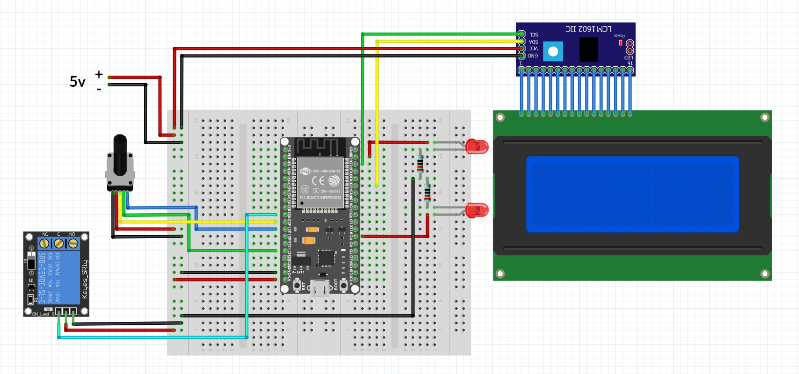

# Time Relay Controller

Simple time relay based on ESP32 + MicroPython

## Features

- Single channel for any relay

- Set ON and OFF timer with infinite loop between them.

- Idle mode with turn off display after 30 sec after last activity and turn on on encoder moved.

- Additional commands: RESET, REBOOT

- LED indicator which show current state.

## Code features

- Simple implementation of event system

- All logic based on classes

## Hardware

- ESP-WROOM-32

- Relay 200v

- LCD Display 2004a 20x4

  https://www.beta-estore.com/download/rk/RK-10290_410.pdf

- I2C adapter for LCD

- Encoder with button

- LED (x2)

- Resistor 220 ohm (x2)

## Schematic

| Pin on part   | Pin on ESP32  |
| ------------- |:-------------:|
| LED1 +        | D23           |
| LED1 -        | RESISTOR      |
| LED2 +        | D4            |
| LED2 -        | RESISTOR      |
| RESISTOR      | GND			|
| ENC +			| VCC			|
| ENC -			| GND			|
| ENC CLK		| D14			|
| ENC DT		| D13			|
| ENC SW		| D27			|
| RELAY +		| VCC			|
| RELAY -		| GND			|
| RELAY SIGNAL  | D26			|
| LCD VCC		| VCC			|
| LCD GND		| GND			|
| LCD SDA		| D21			|
| LCD CSL		| D22			|

## Used external libs

- encoderLib.py

    Encoder library for MicroPython

- python_lcd

    LCD control library. Used only files: lcd_api.py and machine_i2c_lcd.py

# How to install

1. Connect on the breadboard or weld hardware as on schematic

2. Flash MicroPython to ESP32

3. Upload external library to ESP32 (you can get it from libs dir) to root of file system

4. Upload main.py and time_relay.py to ESP32

5. Reboot

## Main Menu

### Line 1: State

- OFFLINE

    Timer is off, nothing happens

- ON

    Timer with POWER ON is in progress

- OFF

    Timer with POWER OFF in progress

### Line 2: POWER ON Timer

Setup POWER ON timer

### Line 3: POWER OFF Timer

Setup POWER OFF timer

### Line 4: Actions

- START ON - start loop from ON state

- START OFF - start loop from OFF state

- STOP - stop timer

- NEXT - switch to next timer now

- RESET - stop and reset timers to 0

- REBOOT - reboot device

- <= - back to main menu (not action)

